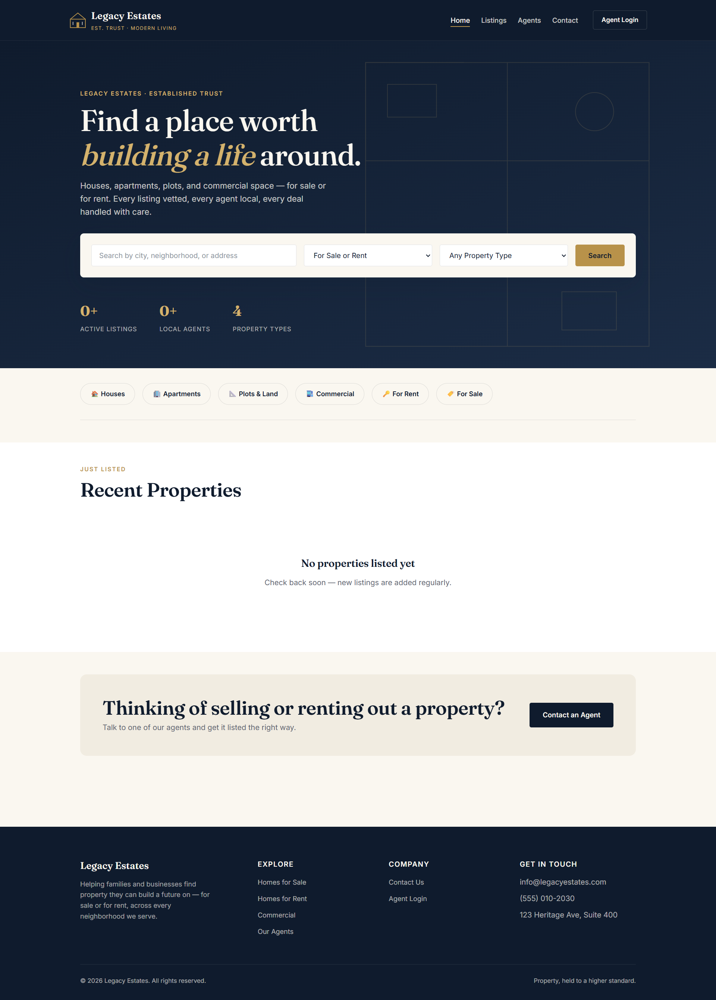
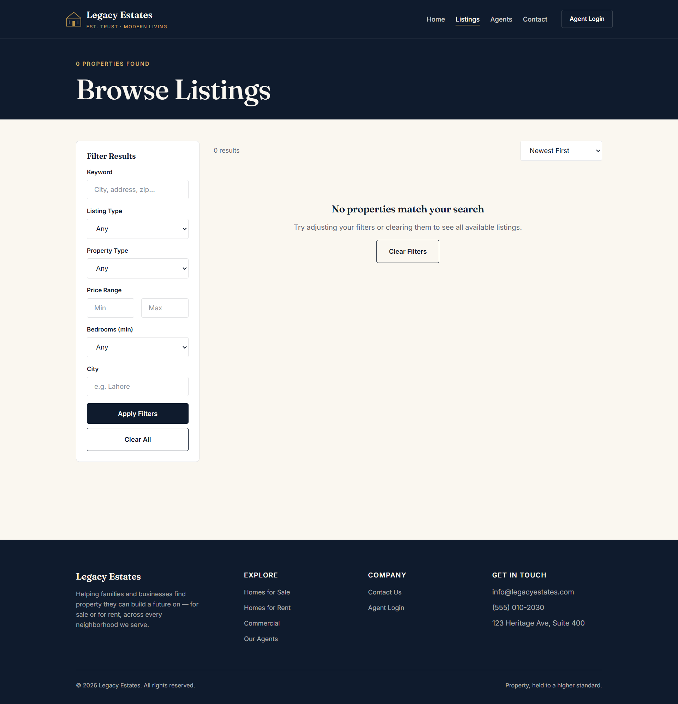
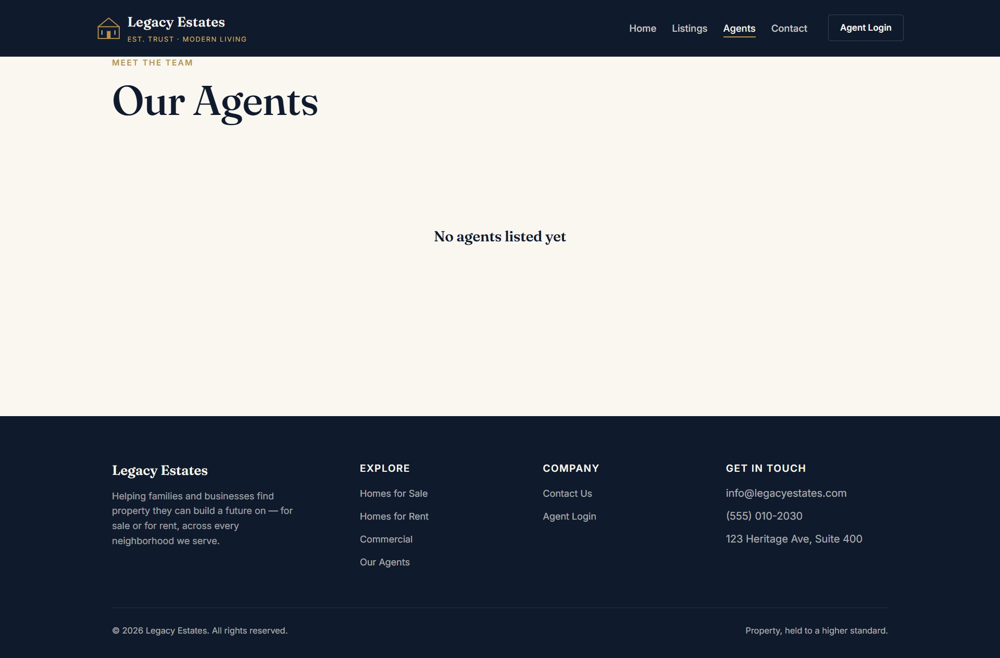
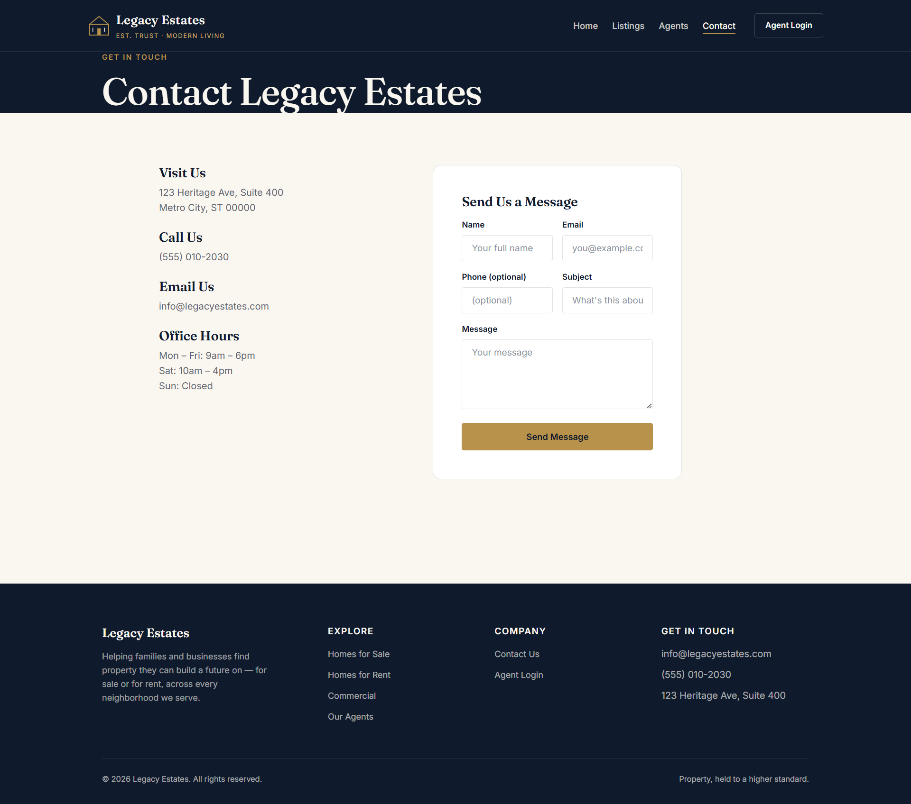

# 🏡 Legacy Estates

A modern full-stack Real Estate Web Application built with Django, designed to help buyers, sellers, and real estate agents manage property listings efficiently.


---

## 🌐 Live Demo

🔗 https://legacyestates.pythonanywhere.com

Admin Panel:

https://legacyestates.pythonanywhere.com/admin/

---

# 📖 Project Overview

Legacy Estates is a professional real estate marketplace built using Django. The platform allows visitors to browse properties for sale or rent, search using advanced filters, and directly contact agents without creating an account.

The system also provides dedicated dashboards for agents and a complete administration panel for managing properties, users, and inquiries.

---

# ✨ Features

- Modern responsive homepage
- Advanced property search
- Property categories
- Sale & Rent listings
- Featured properties
- Property image gallery
- Property inquiry form
- Agent profiles
- Agent Dashboard
- Property CRUD
- Admin Dashboard
- Contact page
- Mobile responsive design
- Professional UI

---

# 🛠 Tech Stack

## Backend

- Python 3.11+
- Django 5.x

## Frontend

- HTML5
- CSS3
- JavaScript
- Django Templates

## Database

- SQLite
- PostgreSQL (Production Ready)

## Deployment

- PythonAnywhere

## Other Libraries

- Pillow
- WhiteNoise
- Gunicorn
- dj-database-url

---

# 📂 Project Structure

```
legacy_estates_deploy/
│
├── accounts/
├── properties/
├── inquiries/
├── templates/
├── static/
├── legacy_estates/
├── manage.py
├── requirements.txt
├── Procfile
├── railway.toml
└── nixpacks.toml
```

---

# 🚀 Installation

Clone the repository

```bash
git clone https://github.com/danishhussain-1/legacy-estates.git
```

Go to project folder

```bash
cd legacy_estates
```

Install dependencies

```bash
pip install -r requirements.txt
```

Run migrations

```bash
python manage.py migrate
```

Create Superuser

```bash
python manage.py createsuperuser
```

Run Server

```bash
python manage.py runserver
```

---

# 👥 User Roles

### Admin

- Manage users
- Manage agents
- Manage properties
- Manage inquiries

### Agent

- Login Dashboard
- Add Property
- Edit Property
- Delete Property
- Upload Property Images

### Public User

- Browse Listings
- Search Properties
- Contact Agents
- Submit Property Inquiry

---

# 📸 Screenshots

## 🏠 Home

```md

```

---

## 🏘 Listings

```md

```

---

## 👨‍💼 Agents

```md

```

---

## 📞 Contact

```md

```

---

# 🔮 Future Improvements

- WhatsApp Integration
- Google Maps
- Email Notifications
- Saved Properties
- Property Comparison
- Admin Analytics
- SSL & Custom Domain

---

# 💡 Challenges Solved

- Railway deployment issues
- Gunicorn configuration
- WhiteNoise static files
- Mobile responsive fixes
- SQLite & PostgreSQL compatibility
- Django widget styling updates

---

# 📄 License

This project is licensed under the MIT License.

---

# 👨‍💻 Author

**Khizra Liaqat**

BS Applied Computing Student

Aspiring Full Stack Developer

GitHub:

https://github.com/danishhussain-1
